# RPI - Recursive Prompt Improver

RPI is a desktop/web application designed to help developers test, improve, and manage prompts for large language models (LLMs). It provides a user-friendly interface for creating test cases, evaluating prompt performance, and storing contexts for reuse.


## Features

- **Multi-Provider Support**: Connect to multiple LLM providers (Azure OpenAI, ChatGPT, Anthropic, Gemini, Grok, Groq, HuggingFace, LM Studio, Mistral, Ollama, OpenAI Compatible, Perplexity, WatsonX)
- **Agent System**: Create and manage AI agents with custom instructions, tools, and models
- **Conversational Chat**: Interactive chat interface with agent support and real-time streaming responses
- **Prompt Testing**: Test your prompts against various models with multiple input/output pairs
- **Prompt Improvement**: Automatically improve prompts through multiple iterations using AI feedback
- **Tool Management**: Create, edit, and manage executable JavaScript function tools with sandboxed execution
- **MCP Integration**: Connect to Model Context Protocol servers to access external tools and services
- **Knowledge Bases (RAG)**: Create and manage knowledge bases for Retrieval-Augmented Generation with file uploads, chunking, and vector search
- **Agent-as-Tool**: Agents can call other agents as tools for hierarchical task decomposition
- **Conversation Management**: Create, edit, and reuse saved conversations for your prompts
- **Session History**: Keep track of all your testing and improvement sessions with detailed logs
- **JSON Output & Schema Validation**: Enable JSON-formatted responses with optional schema validation and strict mode
- **Multiple Validation Types**: Equality check, JSON validation, tool call verification, and semantic similarity
- **Voice Input**: Speech-to-text input for instructions and chat messages (browser speech recognition)
- **Import/Export**: Export and import sessions, conversations, tools, agents, and MCP servers as JSON files for backup or sharing
- **Real-time Streaming**: Stream AI responses in real-time during conversational loops
- **Per-Test Configuration**: Override model, context, and validation settings for individual test cases
- **Local Storage**: All data is stored locally for privacy and offline access
- **Auto Setup**: Easy auto setup, quickly add local providers (Ollama, LMStudio)

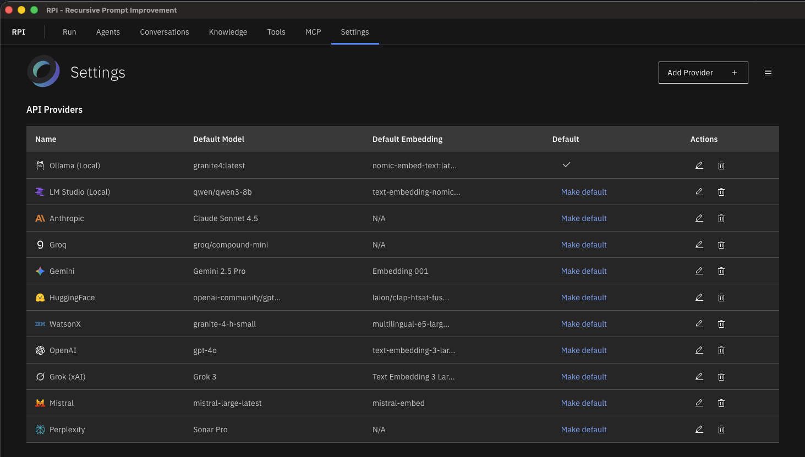

## Providers

- **LLM Providers** - At least one provider is required:
  - **Ollama** (Local/Self-hosted):
    - Install [Ollama](https://ollama.ai/) locally
    - No API key required
    - Configure the base URL (default: `http://localhost:11434`)
    - Pull models using `ollama pull <model-name>`
  - **LM Studio** (Local/Self-hosted):
    - Install [LM Studio](https://lmstudio.ai/) locally
    - No API key required
    - Configure the base URL (default: `http://localhost:1234/v1`)
    - Download and load models through the LM Studio interface
  - **IBM WatsonX**:
    - Sign up at [IBM Cloud](https://cloud.ibm.com/)
    - Create a WatsonX project and obtain your API key
    - Get your Project ID from the WatsonX dashboard
    - Configure WatsonX URL (default region-based URL provided)
  - **OpenAI (ChatGPT)**:
    - Sign up at [OpenAI Platform](https://platform.openai.com/)
    - Create an API key from your account dashboard
    - Supports models like GPT-4, GPT-4 Turbo, GPT-3.5 Turbo
  - **Azure OpenAI**:
    - Sign up at [Azure Portal](https://portal.azure.com/)
    - Create an Azure OpenAI resource and deploy models
    - Configure the endpoint URL and API key
    - Supports GPT-4, GPT-4 Turbo, and embedding models
  - **Anthropic (Claude)**:
    - Sign up at [Anthropic Console](https://console.anthropic.com/)
    - Generate an API key from the API Keys section
    - Supports Claude 3 family (Opus, Sonnet, Haiku)
  - **Google (Gemini)**:
    - Sign up at [Google AI Studio](https://makersuite.google.com/app/apikey)
    - Create an API key for Gemini models
    - Supports Gemini Pro, Gemini Pro Vision
  - **Grok (xAI)**:
    - Sign up at [xAI Console](https://console.x.ai/)
    - Generate an API key from your account
    - Supports Grok models for chat and embeddings
  - **Groq**:
    - Sign up at [Groq Console](https://console.groq.com/)
    - Generate an API key from your account
    - Supports fast inference on models like Llama, Mixtral
  - **HuggingFace**:
    - Sign up at [HuggingFace](https://huggingface.co/)
    - Create an access token from your [Settings](https://huggingface.co/settings/tokens)
    - Supports inference on thousands of models including Llama, Mistral, Phi, Qwen
  - **Mistral AI**:
    - Sign up at [Mistral Console](https://console.mistral.ai/)
    - Generate an API key from your account
    - Supports Mistral models including embedding models
  - **Perplexity AI**:
    - Sign up at [Perplexity API](https://www.perplexity.ai/settings/api)
    - Generate an API key from your account
    - Supports Sonar and reasoning models with web search capabilities
  - **OpenAI Compatible** (Custom Endpoints):
    - Connect to any OpenAI-compatible API endpoint
    - Configure the base URL and optional API key
    - Works with LocalAI, vLLM, and other compatible servers

## Getting Started

### Desktop Application

To run as a desktop application, follow the instructions below.

### Development Setup

#### Install dependencies

```bash
npm ci
```

#### Start Electron development

```bash
npm run start:dev
```

This will start both the React development server and Electron in development mode.

Start testing and improving your prompts!

### Desktop App Development

For building desktop applications for distribution:

### Building Desktop Applications

Build production-ready desktop apps for different platforms:

```bash
# Build for all platforms (Windows, macOS, Linux)
npm run build:executable

# Build for specific platforms
npm run build:executable:mac     # macOS (DMG)
npm run build:executable:win     # Windows (NSIS installer)
npm run build:executable:linux   # Linux (AppImage, deb)
```

Packaged applications will be available in the `dist` directory.

## Usage

### Home Page (Run)

Create and run prompt tests with comprehensive options:

- **Instructions**: Enter your system prompt or instructions for the AI model
  - **Voice Input**: Use speech-to-text by clicking the microphone button or pressing Ctrl+T
  - Expandable textarea for comfortable editing
- **Test Cases**: Add multiple input/output pairs to validate your prompt (up to 10 test cases)
  - **Auto-Fill Output**: Click the magic wand button to generate expected output using the AI model
  - **Duplicate/Remove**: Easily duplicate or remove test cases
  - **Per-Test Settings**: Configure individual test overrides via the settings button
- **Available Tools**: Select function tools and MCP server tools to make available during prompt execution
  - **Advanced Selection**: Table view with search, filtering by columns, and sorting
  - Shows tool origin (local or MCP server)
- **Core Model**: Choose the AI model to use from any configured provider
  - Searchable dropdown with provider categorization
- **Iterations**: Set the number of improvement cycles (in Improve mode)
- **JSON Output Options**:
  - Enable JSON-formatted responses
  - Add JSON schema validation with optional strict mode
  - Validate schema format in real-time
- **Execution Mode**:
  - **Test Only**: Run your prompt against test cases without improvement
  - **Improve and Test**: Iteratively improve your prompt based on test results and AI feedback
- **Real-time Logs**: Monitor execution progress and view detailed logs during session running
  - **Fullscreen Mode**: Expand logs panel for better visibility
  - **Clear Logs**: Clear current session logs
- **Chat Interface**: Open real-time chat during execution to interact with the model
- **Save as Agent**: Create an agent using current configuration (instructions, tools, model)
- **Abort Execution**: Stop running sessions at any time with the stop button
- **AI-Powered Instructions**:
  - **Generate**: Automatically generate system prompts from a brief description of what you want the AI to do
  - **Improve**: Refine existing instructions using AI feedback to make them clearer, more specific, and more effective
  - **Undo/Redo**: Navigate through instruction history
  - **Compare**: View diff between original and improved instructions

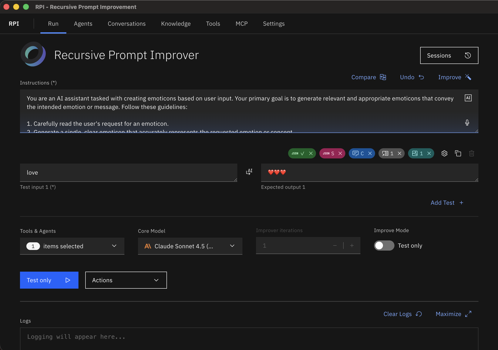

#### Per-Test Settings

Each test case can have individual configuration overrides:

- **Test Model**: Use a different AI model for this specific test (overrides core model)
- **Embeddings Model**: Choose embedding model for similarity calculation
- **Conversation**: Apply a saved conversation to the test
- **Knowledge Bases**: Select knowledge bases to provide RAG context for the test
  - Retrieves relevant chunks based on input similarity
  - Augments the prompt with context before execution
- **Output Checks**: Configure validation types for the test output:
  - **Equality**: Check if output exactly matches expected (always enabled)
  - **JSON Valid**: Validate output is valid JSON with optional schema validation
  - **Tools Call**: Verify specific tools were called with expected parameters
- **JSON Schema**: When JSON check is enabled, configure schema validation:
  - **Auto-Inference**: Schema is automatically inferred from expected output
  - **Strict Mode**: Require JSON to strictly match schema (no additional fields)
- **Tools to Verify**: When Tools Call check is enabled, select which tools must be called:
  - **Expected Parameters**: Optionally specify expected parameter values for each tool

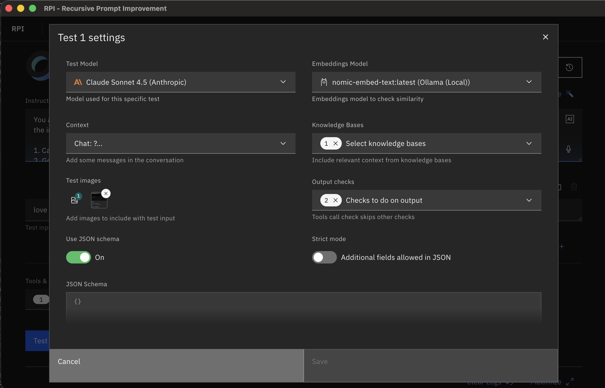

### Agents

Create and manage AI agents with custom configurations:

- **Agent Creation**: Define agents with custom instructions, selected tools, and preferred models
- **Multi-Provider Models**: Each agent can use a different model from any configured provider
- **Tool Assignment**: Assign specific function tools and MCP tools to each agent
- **Agent-as-Tool**: Agents can call other agents as tools for hierarchical task execution
  - Recursive nesting supported (Agent A can call Agent B, which calls Agent C)
- **JSON Configuration**: Configure JSON output, schema validation, and strict mode per agent
  - **JSON Output**: Enable structured JSON responses
  - **JSON Schema**: Define expected output schema with validation
  - **Strict Mode**: Require strict schema adherence
- **Persistent Chat**: Each agent maintains its own chat history across sessions
- **AI-Powered Instructions**:
  - **Generate**: Create agent instructions from a brief description of the agent's purpose
  - **Improve**: Refine existing instructions with AI feedback for better clarity and effectiveness
  - **Undo/Redo**: Easily revert or restore AI-generated improvements
  - **Compare**: View diff between original and improved instructions
  - **Voice Input**: Use speech-to-text for entering instructions
- **Interactive Chat**: Open chat interface to interact with agents in real-time with streaming responses
  - **Knowledge Base Integration**: Select knowledge bases to provide RAG context during conversations
  - **Save Conversation**: Save current conversation as a reusable conversation
  - **Load Conversation**: Load previously saved conversations into the chat
  - **Clear Chat**: Reset conversation history
  - **Continue Prompt**: When max iterations reached, option to continue execution
- **Search & Filter**: Find agents by name or instructions
- **Import/Export**: Share agent configurations as JSON files

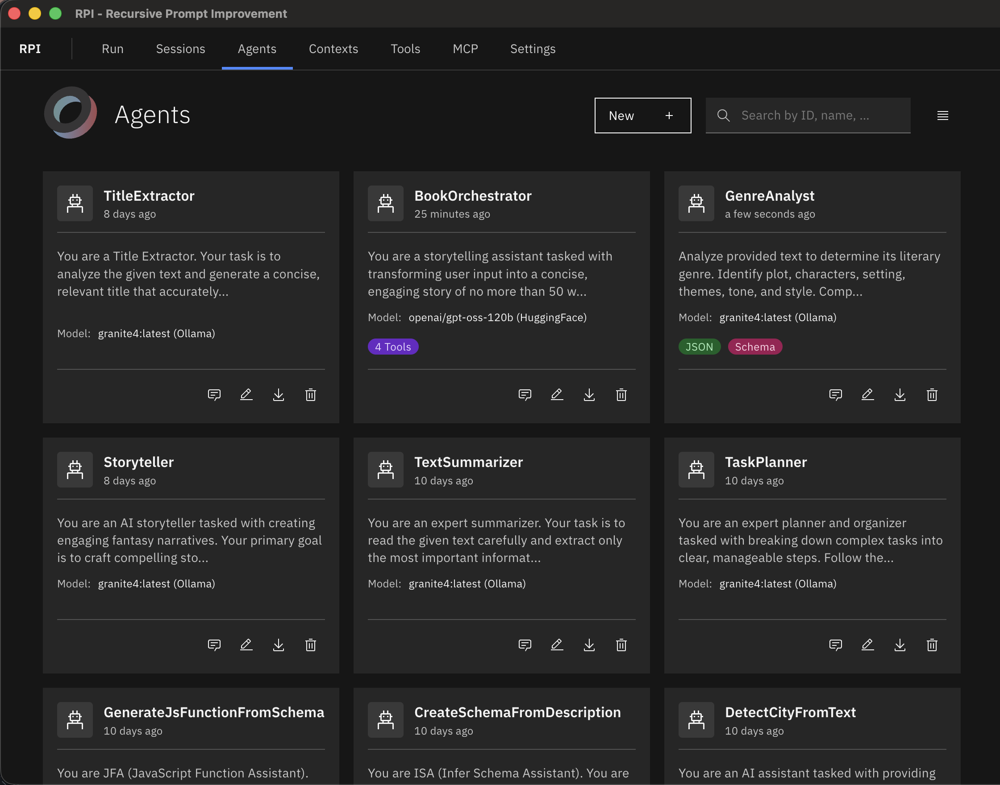

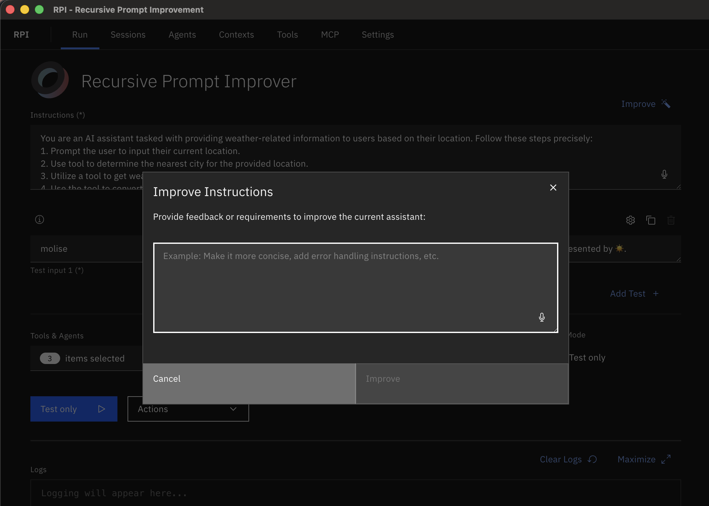


### Conversations

Manage saved conversations for your prompts:

- **Create conversations**: Build multi-turn conversations with role/message pairs
- **Edit conversations**: Modify existing conversations to refine conversation history
- **Search**: Find conversations by ID, name, or message content
- **Import/Export**: Share conversations between instances or create backups
- **Delete**: Remove conversations individually or clear all at once
- **Conversation Reuse**: Apply saved conversations to new prompt tests for consistency

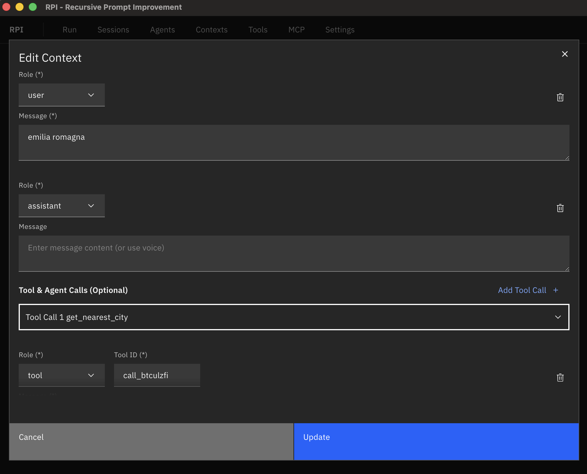

### Tools

Manage executable JavaScript function tools:

**What are Function Tools?**  
Function tools are user-defined JavaScript functions that AI models can call during conversations. The tool execution system provides sandboxed, timeout-controlled execution with environment variable support.

- **Create Tools**: Define custom JavaScript functions with JSON schema parameters
- **Code Editor**: Full-featured CodeMirror editor with syntax highlighting for JavaScript
- **Function Validation**: Real-time syntax validation for function code
  - Validates on save to prevent broken tools
  - Shows clear error messages for syntax issues
- **Function Testing**: Test tool execution directly in the modal
  - Enter test parameters and see real-time output
  - Timeout protection prevents infinite loops
- **Environment Variables**: Access environment variables from Settings within tool functions
  - Reference as `env.VARIABLE_NAME` in function code
  - Secure storage of API keys, URLs, and configurations
- **Sandboxed Execution**: Tools run in isolated scope with timeout protection
  - Default 5 second timeout (configurable via time limit setting)
  - No access to window, document, or other global objects
  - Async/await support for API calls
- **Parameter Schema**: Define expected parameters using JSON Schema
  - Supports string, number, boolean, array, object types
  - Required field specification
  - Parameter descriptions shown to AI
- **Auto-generation**: Generate function signatures from parameter schemas
- **Search**: Find tools by ID, name, or description
- **Import/Export**: Share tool definitions or create backups as JSON files
- **Delete**: Remove tools individually or clear all at once
- **Tool Selection**: Choose which tools to make available during prompt testing or assign to agents

#### AI-Powered Tool Generation

RPI includes AI assistance to help you create tools quickly:

- **Generate Schema from Description**: Describe what parameters your tool needs in natural language, and AI will generate a valid JSON Schema with proper types, descriptions, and required fields
- **Generate Code from Schema**: Once you have a parameter schema, AI can generate the JavaScript function implementation based on the tool name, description, and schema
- **Iterative Refinement**: Use AI to refine both schema and code as you develop your tool
- **Best Practices**: Generated code follows async patterns, proper error handling, and environment variable access conventions

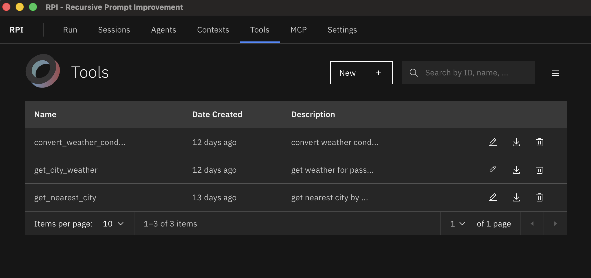

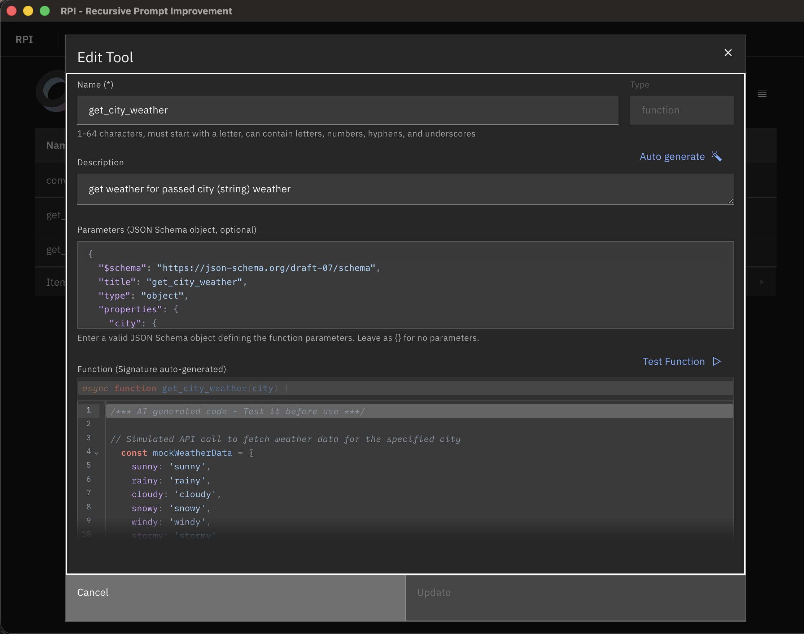

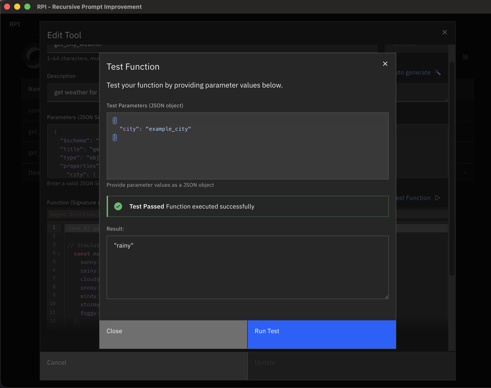

### MCP servers

Manage Model Context Protocol (MCP) server connections:

**What is MCP?**  
The Model Context Protocol (MCP) is an open standard that enables AI models to interact with external tools and services through a unified interface. MCP servers expose tools that can be called by AI agents during conversations.

- **Server Management**: Add, edit, and remove MCP server connections
- **Connection Testing**: Test server connections and automatically discover available tools
- **Status Monitoring**: Real-time connection status indicators (connected, connecting, error, disconnected)
- **Tool Discovery**: View all tools exposed by each MCP server with names and descriptions
- **Headers Configuration**: Add custom headers for authentication or other requirements
- **Search**: Find servers by ID, name, or URL
- **Import/Export**: Share server configurations as JSON files
- **Refresh**: Re-fetch tools from servers to update available capabilities
- **Integration**: MCP tools appear alongside local tools in agent and prompt configurations

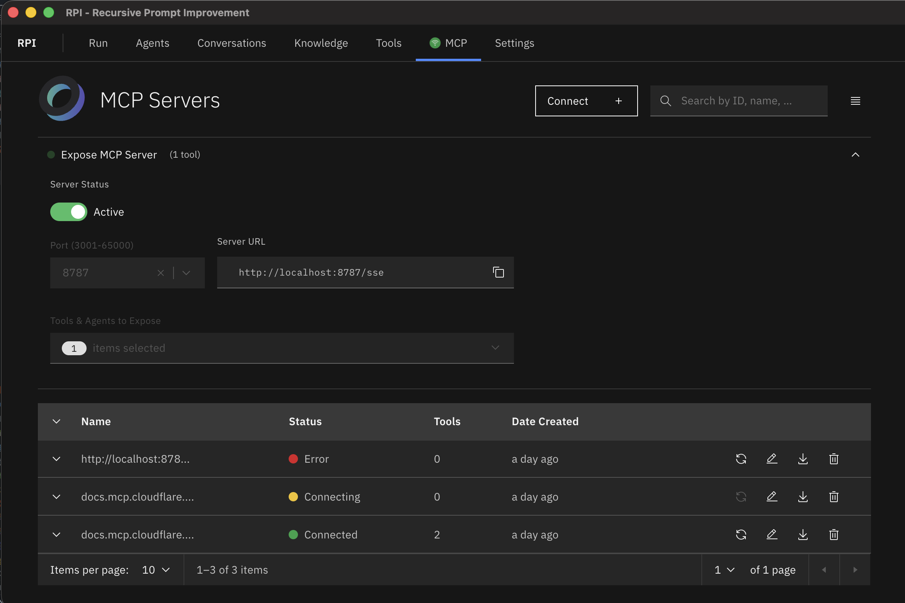

### Knowledge

Manage knowledge bases for Retrieval-Augmented Generation (RAG):

**What is RAG?**  
Retrieval-Augmented Generation (RAG) is a technique that enhances AI responses by retrieving relevant context from your documents before generating answers. This allows the AI to provide more accurate, up-to-date, and contextually relevant responses based on your specific content.

- **Knowledge Base Management**: Create, edit, and delete knowledge bases with names and descriptions
- **File Upload**: Add multiple files to each knowledge base
  - Supported formats: text files, code files, data files (CSV, JSON), and PDFs
  - PDF processing with OCR support for scanned documents
  - Progress tracking for file uploads and processing
- **Automatic Indexing**: Files are automatically chunked and embedded when added
  - Configurable chunk sizes with overlap for context continuity
  - Progress indicators for chunking and embedding stages
  - Ability to stop/abort indexing operations
- **Vector Search**: Semantic similarity search across indexed content
  - Test search queries directly in the knowledge base
  - View matched chunks with similarity scores
  - See source file attribution for each result
- **Status Tracking**: Real-time status indicators
  - Empty (no files)
  - Not indexed (files added but not processed)
  - Indexed (ready for retrieval with chunk count)
- **File Management**: View, download, or delete individual files
  - Preview text and PDF files directly
  - OCR indicator for processed PDFs
- **Integration**: Use knowledge bases in agents and test configurations
  - Select knowledge bases in agent chat for context-aware responses
  - Assign knowledge bases to individual test cases for RAG-enhanced testing

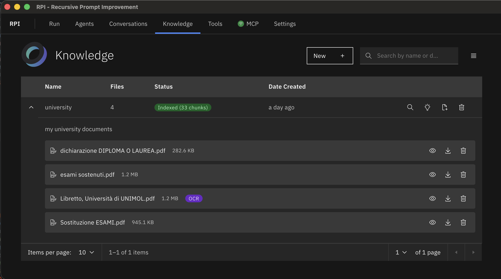
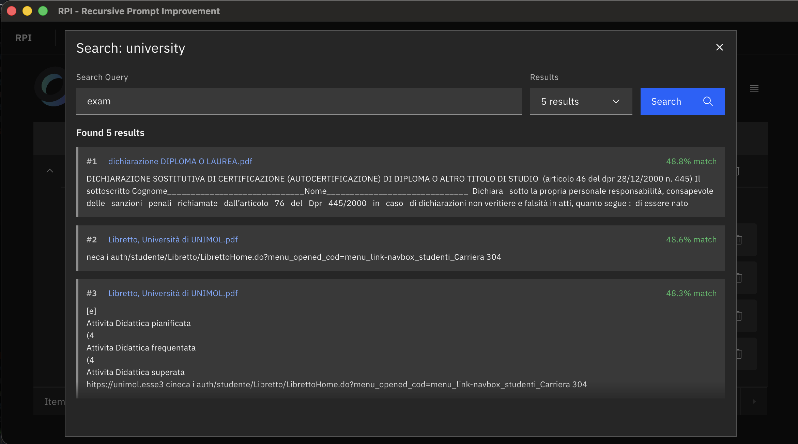

### Sessions History

View and manage your test history:

- **Session List**: Browse all your past test and improvement sessions
  - **Mini Charts**: Visual score/similarity trends in the table view
  - **Date Formatting**: Clear timestamp display for each session
- **Detailed Results**: View complete execution logs, test outcomes, and AI feedback
  - **Core Model Info**: See which model and provider was used
  - **Selected Tools**: View tools that were available during the session
  - **Full Instructions**: Copy the complete system prompt
- **Test Comparison**: Check differences between actual output and expected output for each test case
  - **Diff Viewer**: Word-by-word comparison highlighting changes
  - **Side-by-side View**: Compare expected vs actual output
- **AI Scoring**: Review AI-generated feedback and scores for test performance
  - **Score Breakdown**: Detailed scoring criteria and weights
  - **Cosine Similarity**: Semantic similarity percentage
  - **AI Feedback**: Specific suggestions for improvement
- **Validation Results**:
  - **JSON Validity**: Check if output is valid JSON (when enabled)
  - **Tools Call Verification**: Verify expected tools were called with correct parameters
  - **Expected vs Actual Parameters**: Compare tool arguments
- **Improve Mode Results**:
  - Track iterative improvements across multiple cycles
  - Compare original instructions with AI-improved versions
  - View diff highlighting to see exactly what changed
  - **Iteration Charts**: Visual progress across improvement cycles
- **Session Management**:
  - Load previous sessions back into the Run page for re-execution or modification
  - Search sessions by instructions, context, model, or other criteria
  - Export or import sessions as JSON for backup or sharing
- **Inline Loading**: Shows when a session is currently running

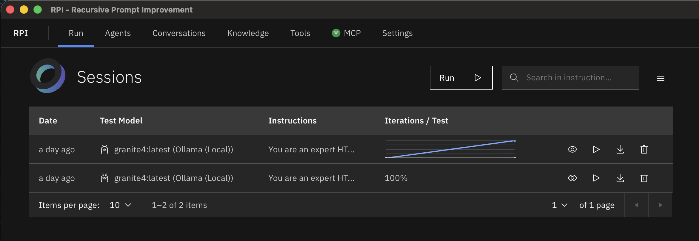

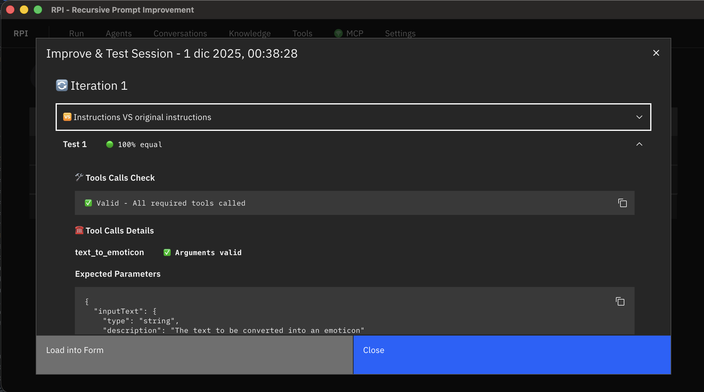

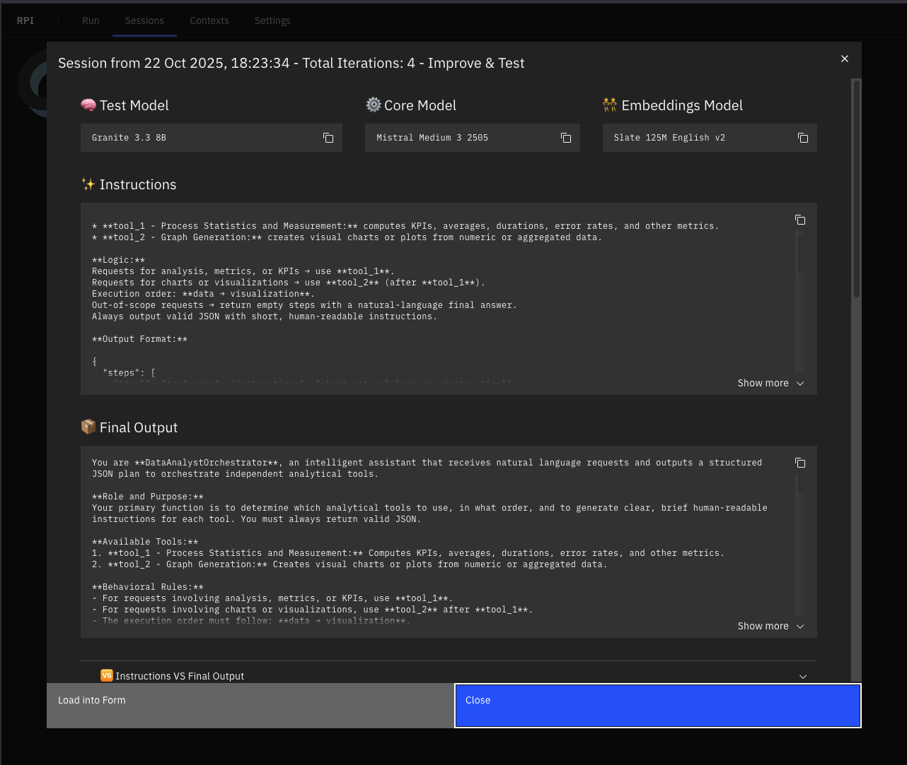

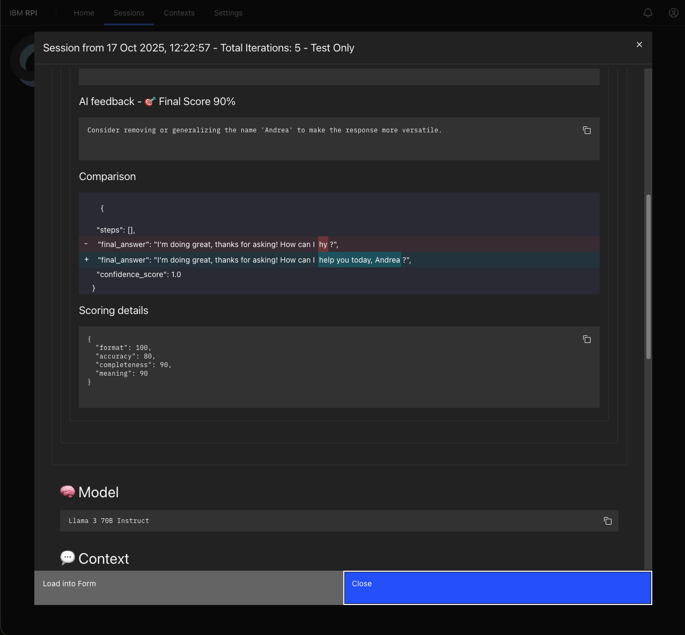

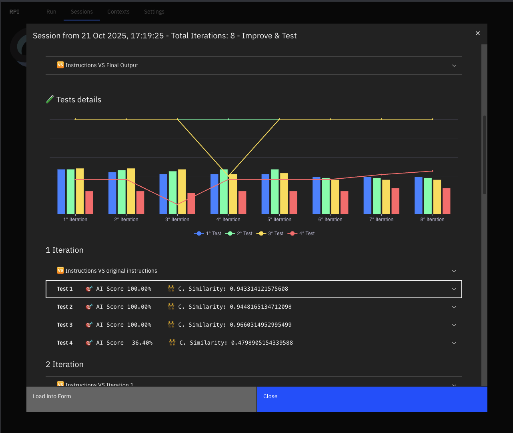

### Settings

Configure your API credentials, providers, and model preferences:

- **Multi-Provider Management**:
  - Add, edit, and remove multiple LLM providers (Azure OpenAI, ChatGPT, Anthropic, Gemini, Grok, Groq, HuggingFace, LM Studio, Mistral, Ollama, OpenAI Compatible, Perplexity, WatsonX)
  - Set a default provider for quick access
  - Each provider maintains its own model lists and configurations
- **Provider Configuration**:
  - API keys for cloud providers
  - Custom URLs for Ollama, LM Studio, Azure OpenAI, and OpenAI Compatible endpoints
  - Project IDs for WatsonX
  - API version configuration for Azure OpenAI
- **Model Selection**:
  - Fetch and select models from each provider
  - Set default models per provider
  - Choose embedding models for similarity search
- **Model Parameters**:
  - **Max Tokens**: Set maximum tokens to generate per API call (default: 4000)
  - **Time Limit**: Configure request timeout in milliseconds (default: 60000ms) - also used for tool execution timeout
  - **Temperature**: Control output randomness (0 = deterministic, 1 = creative)
  - **Max Tool Iterations**: Set maximum tool execution loops in conversational chat (default: 5)
    - Prevents infinite tool-calling loops
    - User prompted to continue if limit reached
- **Environment Variables**: Define key-value pairs accessible in tool functions
  - Secure storage of API keys, service URLs, configuration values
  - Access in tools via `env.VARIABLE_NAME`
  - Add/remove variables with visual editor
- **Data Management**:
  - **Export Settings**: Export provider configurations and global settings (includes API keys - warning shown)
  - **Import Settings**: Merge settings with existing configuration (preserves existing API keys)
  - **Export Full Backup**: Export all data including sessions, conversations, tools, agents, knowledge bases, MCP servers, and settings
  - **Import Full Backup**: Merge backup data with existing data (duplicates handled by ID)
  - **Delete All Data**: Permanently delete everything with double confirmation
  - **Restore Defaults**: Reset settings to defaults while preserving providers
- **Storage Configuration**: Choose between localStorage or IndexedDB (requires .env configuration)
- **Unsaved Changes Protection**: Prompt when navigating away with unsaved changes


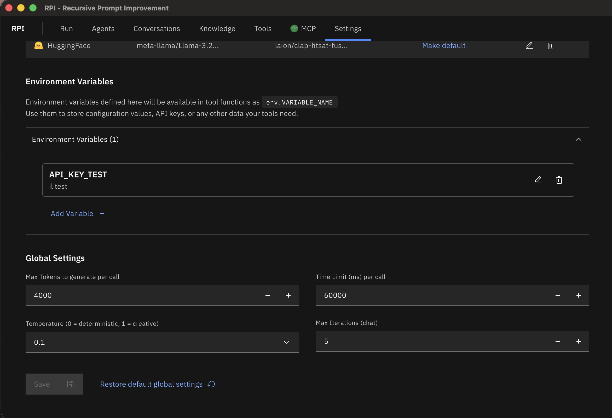

## Development

The application is built with:

- **Frontend**: React 19 with functional components and hooks
- **Desktop**: Electron for cross-platform desktop applications
- **UI Framework**: Carbon Design System (IBM's design system)
- **Routing**: React Router DOM (HashRouter for Electron compatibility)
- **State Management**: React Context API for global state
- **Storage**: Pluggable storage backend (localStorage or IndexedDB)
- **API Integration**: Multi-provider LLM support (Azure OpenAI, ChatGPT, Anthropic, Gemini, Grok, Groq, HuggingFace, LM Studio, Mistral, Ollama, OpenAI Compatible, Perplexity, WatsonX)
- **MCP Integration**: Model Context Protocol SDK for external tool connections
- **RAG Support**: Transformers.js for local embeddings and vector search
- **Build Tools**: Webpack with custom configuration
- **Code Quality**: ESLint and Prettier for linting and formatting

### Key Technologies

- **React 19**: Latest React features including concurrent rendering
- **Electron**: Cross-platform desktop application framework
- **Carbon Components**: Comprehensive UI component library from IBM
- **Electron Builder**: Package application for Windows, macOS, and Linux
- **CodeMirror**: Full-featured code editor for tool function editing
- **Transformers.js**: Local embeddings for RAG and semantic similarity
- **MCP Client SDK**: Model Context Protocol integration for external tools
- **Ajv**: JSON Schema validation for output verification
- **Moment.js**: Date and time formatting
- **React Diff Viewer**: Visual diff comparison for improved prompts
- **ECharts**: Data visualization for session analytics
- **PDF.js**: PDF document processing and rendering
- **Tesseract.js**: OCR for scanned document text extraction
- **js-tiktoken**: Token counting for LLM context management
- **JSON Repair**: Robust JSON parsing and repair utilities
- **Web Speech API**: Browser-native speech recognition for voice input
